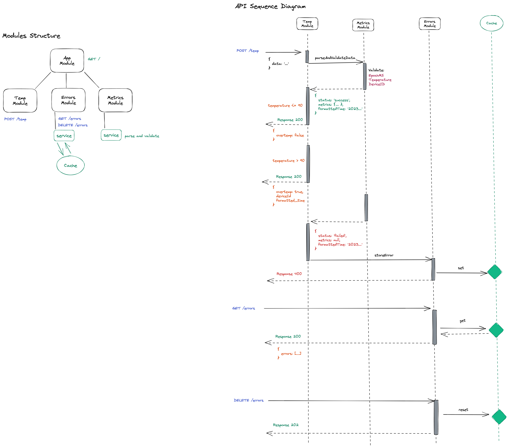

# Metrics Hub

## Description

[Metrics Hub](https://github.com/biosis21/metrics-hub) - system to aggregate, handle, validate factory data.

## Engines
```bash
  node: >=16.0.0
  npm: >=8.0.0
```

## Installation

```bash
# use correct nodejs version
$ nvm use

# install project packages
$ npm install
```

## Running the app

```bash
# development
$ npm run start

# watch mode
$ npm run start:dev

# production mode
$ npm run start:prod
```

## Test

```bash
# unit tests
$ npm run test

# e2e tests
$ npm run test:e2e

# test coverage
$ npm run test:cov
```
## Cloud Computing Services

[AWS Beanstalk](https://aws.amazon.com/elasticbeanstalk/)

[AWS CodePipeline](https://aws.amazon.com/codepipeline/)

[AWS EC2](https://aws.amazon.com/ec2/)

## API

http://mhub-env.eba-dkemsizz.us-west-1.elasticbeanstalk.com/

## API Documentation & Playground

Created via Swagger - http://mhub-env.eba-dkemsizz.us-west-1.elasticbeanstalk.com/api

## Architecture

Modules Structure and API Sequence Diagram



## Postman Collection

Postman v2.1

[Metrics Hub Collection](./metrics-hub.postman_collection.json)